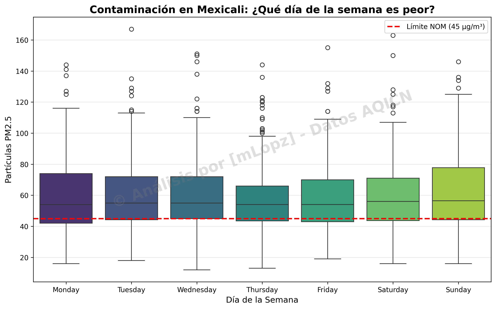

**Análisis de Datos:**

La Realidad de la Calidad del Aire en Mexicali

Hipótesis: ¿La contaminación en Mexicali es exclusiva del invierno o es un problema sistémico de todo el año?

Este repositorio contiene un Análisis Exploratorio de Datos (EDA) sobre las concentraciones de partículas PM2.5 en Mexicali, Baja California. El proyecto nace de la necesidad de verificar con datos duros la narrativa común de que "la contaminación es solo por fechas festivas", contrastándola con la realidad estadística.

Contenido del Repositorio
**Auditoría de Datos:** Limpieza y validación de datasets históricos (AQICN).
**Análisis Estacional:** Comportamiento de los contaminantes mes a mes.
**Ciclo Semanal:** Comparativa entre días laborales y fines de semana.

Tecnologías
**Python 3**
**Pandas:** Manipulación de series de tiempo y limpieza ETL.
**Seaborn & Matplotlib:** Visualización estadística (Boxplots, Heatmaps).
**Data Source:** World Air Quality Index Project (AQICN).

Hallazgos Clave (Data-Driven)

1. El mito de la "Estacionalidad Exclusiva"
Si bien existe un repunte crítico en invierno (efecto de inversión térmica), los datos revelan que **ningún mes del año** cumple consistentemente con los estándares de salud recomendados por la OMS. Incluso en verano, la media de PM2.5 se mantiene en niveles de riesgo moderado.

2. No hay "Días de Descanso"
Al contrastar los días de la semana, se refuta la idea de que la baja actividad industrial de los fines de semana limpia el aire. Los **domingos** presentan niveles de contaminación estadísticamente similares (e incluso picos superiores) a los días laborales, sugiriendo un fuerte impacto de actividades domésticas y recreativas.

3. Invierno Crítico
Se confirman los picos extremos ("Outliers") durante *Diciembre y Enero*, donde las concentraciones superan hasta en un 400% la norma oficial mexicana, coincidiendo con fechas festivas y bajas temperaturas.

Nota Técnica sobre los Datos
Este análisis utiliza datos históricos agregados. Se eligió el dataset de AQICN por su consistencia temporal frente a los vacíos encontrados en los reportes gubernamentales crudos. Los valores representan promedios diarios, lo que permite observar macro-tendencias efectivas para la toma de decisiones ciudadanas.

---
*Autor: Miguel Angel Lopez Veloz
*Estudiante de Ingeniería en Desarrollo de Software | Mexicali, B.C.

2025
